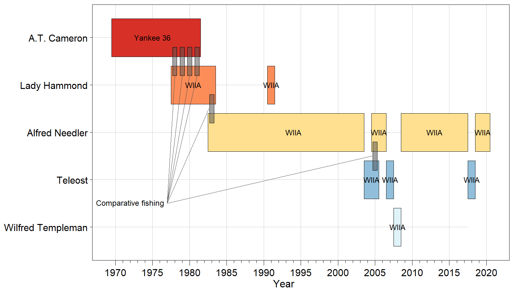
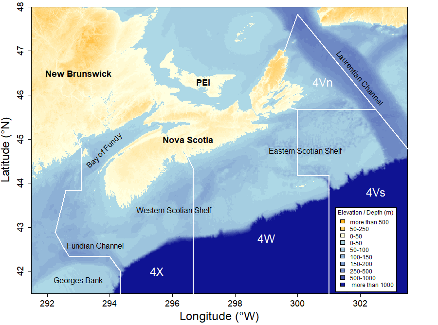
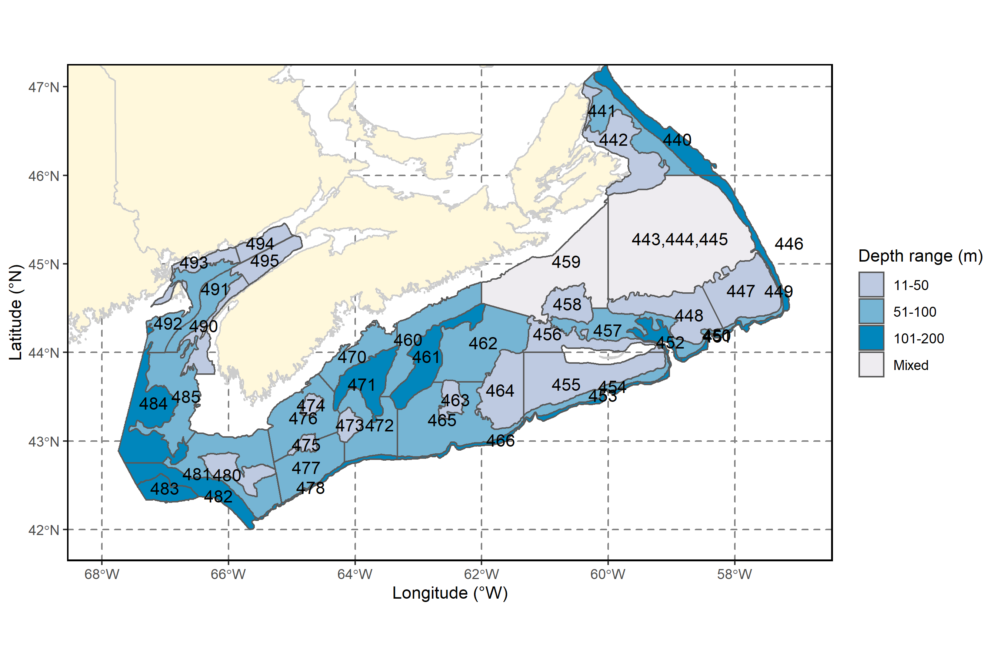

# Methods
## Survey Description
The survey is conducted annually in July-August and covers the Scotian Shelf and the Bay of Fundy (Figure \@ref(fig:map1)). It normally involves two separate two-week trips on board an offshore fisheries vessel from the Canadian Coast Guard.

A number of changes in fishing gear type and vessels used occurred since the onset of sampling activities [@ClarkEmberley2011]. Comparative fishing experiments were conducted when those changes in survey platforms took place. A timeline of the survey platforms can be found in Figure \@ref(fig:timeline).

(ref:caption-timeline) Timeline of vessels and gears used in the Maritimes Region summer survey. The y axis identifies the vessel used and the gear used is overlaid on the polygon representing the time window where each vessel was used.

```{r timeline, fig.cap="(ref:caption-timeline)"}

```


(ref:caption-map1) Map of the Scotian Shelf and Bay of Fundy where the DFO Maritimes summer survey takes place. The bathymetry presented here is the 15 arc-second gridded data set from the General Bathymetric Chart of the Oceans ([GEBCO](https://www.gebco.net/data_and_products/gridded_bathymetry_data/)). Geographical locations of interest and the boundaries of relevant NAFO Divisions are also shown on the map.

```{r map1, fig.cap="(ref:caption-map1)"}

```

## Sampling Design
The summer survey covers divisions 4V, 4W and 4X of the Northwest Atlantic Fisheries Organization (NAFO) which includes the Scotian Shelf and the Bay of Fundy. The eastern limit of the survey is the Laurentian Channel and the western limit is the Fundian Channel (Figure \@ref(fig:map1)).

The survey follows a stratified random design [@DoubledayRivard1981; @Lohr1999] (Figure \@ref(fig:map2)). The number of tows conducted in each stratum is approximately proportional to the surface area of the stratum. The targeted area covered by the survey has remained constant since its inception, with the exception of additional deeper strata that were only sampled a few times since 2000. Because the sampling of the deeper strata is opportunistic and irregular, the analyses presented herein only include strata 440 to 495 which cover NAFO Divisions 4V, 4W and 4X (Figure \@ref(fig:map2) and Table \@ref(tab:tabstrata)).

The basic sampling unit of the survey is a 30-minute fishing tow conducted at a speed of 3.5 knots. This yields a distance towed of 1.75 nautical miles. 

(ref:caption-map2) Map of the summer survey strata 440 to 495. 

```{r map2, fig.cap="(ref:caption-map2)"}

```


\clearpage

(ref:strata-tab-cap) Summer survey strata details. The strata used in the analyses are presented separately for NAFO Divisions 4Vn, 4VsW and 4X. For each stratum, the depth range in fathoms and the surface area in square kilometers are reported.

```{r tabstrata}
library(tidyverse)
strata.tab <- read.csv("strata-statistics.csv", encoding = "UTF-8")
strata.tab[strata.tab$NAME=="4VSW","NAME"] <- "4VsW"
strata.tab[strata.tab$NAME=="4VN","NAME"] <- "4Vn"

strata.tab[strata.tab$DMIN==0,"DMIN"] <- 11
strata.tab[strata.tab$DMIN==49,"DMIN"] <- 50

strata.tab$DRANGE <- paste0(strata.tab$DMIN, "-", strata.tab$DMAX)


oo <- order(strata.tab$STRAT)

vars <- c("NAME","STRAT","DRANGE","AREA")

csasdown::csas_table(
  strata.tab[oo,vars], 
  format="latex", 
  align = rep("c",4), 
  col.names = c("NAFO Div.", "Stratum", "Depth range (fathom)","Area (km \\textsuperscript{2})"), 
  caption = "(ref:strata-tab-cap)",
  row.names=FALSE,
  booktabs=TRUE,
  longtable=TRUE,
  repeat_header=TRUE
  )  %>% 
  kableExtra::collapse_rows(1:2, latex_hline = "major", valign = "middle") #, row_group_label_position = 'stack')

```


After each tow the catch is sorted by species and weighed. Each fish caught is then measured, and further sampling of individual fish weight, maturity status and age are performed for different length classes. When catches exceed 300 individuals, a random sub-sample is used to obtain the length and weight measurements.


## Taxonomic Levels {#taxo}

Fish species caught during the surveys are identified by trained scientific personnel and their scientific name is determined. An internal species code used in the relational database is reported for each species [@LosierWaite1989].

By its nature as a bottom trawl, the fishing gear used in the survey catches certain species better than others. To ensure that meaningful ecological information can be extracted from catch samples, we report the catch records for the subset of species that are caught reliably by the gear. To appear in this atlas, a species must have had a minimum of 10 observations over the duration of the survey activities. While both catch abundance and weight are recorded, the weight of species that appear at low abundances is often recorded as zero in the earlier parts of the survey when scales of appropriate precision were not available.

We divided the species caught into five categories based on 1) their taxonomic classification, 2) the number of recorded observations, and 3) their period of valid identification (Table \@ref(tab:taxocat)). Category ”LF”, for ”long frequent”, was assigned to species that have more than 1000 records since 1970 and have been consistently identified since the onset of the survey. Category ”LI”, for ”long intermediate”, was assigned to species that had between 1000 and 200 catch records. Rare and elusive species (those with less than 200 catch records over the duration of the survey) are also reported but to a lower level of analytical details (Category ”LR”, for ”long rare”). Category ”SF”, for ”short frequent”, was assigned to invertebrate species that were consistently sampled only since 1999 [@Tremblayetal:2007]. And category ”SR”, for ”short rare” for invertebrate species consistently sampled only since 1999 and with less than 200 catch records.


\begin{table}
\caption{Taxonomic levels used to determine the analytical treatment for each species.}
\begin{tabular}{p{0.1\textwidth}p{0.2\textwidth}p{0.7\textwidth}}
\toprule
\bfseries{Category} & \bfseries{Name} & \bfseries{Description} \\
\midrule
L & \multicolumn{2}{l}{long - consistently identified since the onset of the survey in 1970}\\
\midrule
LF & long frequent & species that have more than 1000 catch records \\

LI & long intermediate & species that had between 1000 and 200 catch records\\

LR & long rare & species with less than 200 catch records\\
\midrule
S & \multicolumn{2}{l}{short - invertebrate species that were consistently sampled only since 1999}\\
\midrule
SF & short frequent & species with more than 200 catch records \\

SR & short rare & species with less than 200 catch records\\
\bottomrule
\end{tabular}
\label{tab:taxocat}
\end{table}


To ensure concordance with authoritative taxonomic information, the AphiaID from the World Register of Marine Species [@WoRMS] is included for the different species presented in this document (Table \@ref(tab:tabspecies)) .

(ref:spec-fig-cap) List of species included in the Atlas. For each taxonomic order and class, each species is listed in the table, its taxonomic family and scientific name is provided, along with its French and English common names, the species code used in the survey database, its AphiaID with a link to the World Registry of Marine Species, its number of catch records in the survey database and its classification category as defined in section \@ref(taxo).

\begin{landscapepage}
```{r tabspecies}
library(tidyverse)
spec.tab <- read.csv("species-list-for-report-APHIA.csv", encoding = "UTF-8")
urls <- spec.tab$url
sections <- paste0("#sec:",spec.tab$spec)

vars <- c("class","order","family","scientificname","FAO_E_COMMON_NAME","FAO_F_COMMON_NAME","spec", "AphiaID", "nrecords","type")

oo <- order(spec.tab$class, spec.tab$order, spec.tab$family, spec.tab$scientificname)
#knitr::kable(spec.tab[,vars], "latex", booktabs = TRUE, longtable = TRUE, align = "c", col.names = c("Class","Order","Family","Scientific name","English name","French name","Species code","AphiaID","Num. records","Category"), caption = "(ref:spec-fig-cap)") %>%
csasdown::csas_table(
  spec.tab[oo,vars], 
  "latex", 
#  booktabs = TRUE, 
#  longtable = TRUE, 
  align = "c", 
  col.names = c("Class","Order","Family","Scientific name","English name","French name","Species code","AphiaID","Num. records","Category"), 
  caption = "(ref:spec-fig-cap)",
  row.names=FALSE) %>%
  kableExtra::collapse_rows(1:3, row_group_label_position = 'stack', row_group_label_fonts=list(bold = T), longtable_clean_cut=FALSE) %>% # latex_hline = "major"
  kableExtra::column_spec(4, italic=T, width="3cm") %>% 
  kableExtra::column_spec(5, width="3cm") %>% 
  kableExtra::column_spec(6, width="3cm") %>% 
  kableExtra::column_spec(7, width="3cm") %>% 
  kableExtra::column_spec(7, link=sections) %>% 
  kableExtra::column_spec(8, link=urls) %>% 
  kableExtra::kable_styling(font_size = 9) %>%  #, latex_options = "repeat_header", repeat_header_text = "", repeat_header_method = "replace"
  sub("\\caption\\[\\]\\{\\}", "\\caption*{}", .) 

```
\end{landscapepage}

## Analyses

The Oracle relational database where all survey data are stored and archived is accessible from the Bedford Institute of Oceanography in Dartmouth, Nova Scotia. Queries written in Structured Query Language (SQL) are used to extract the data from the production server and to create the data products used in all subsequent analyses. Catch records classified as ”valid” (i.e. coming from a representative tow without damage to the net) are used in the current analyses. To make the available samples comparable, catch number and weight for each species was standardized for the distance towed. 

All data processing and analyses were conducted using the R software [@R:2020] using packages gstat [@R:package:gstat], PBSmapping [@R:package:PBSmapping], RODBC [@R:package:RODBC], spatstat [@R:package:spatstat],  maptools [@R:package:maptools], rgeos [@R:package:rgeos], classInt[@R:package:classInt], RColorBrewer[@R:package:RColorBrewer], MASS [@R:package:MASS], worms [@R:package:worms], and tidyverse [@R:Tidyverse]. The present document is rendered as a Technical Report using the csasdown R package developed and maintained by Fisheries and Oceans Canada scientists [@R:csasdown].

### Geographic distribution of catches

Spatial interpolation of catch biomass (kg/tow) was done using a weighting inversely proportional to the distance (inverse-distance weighted, IDW), using function ”idw” of the spatstat R package [@R:package:spatstat]. The IDW method was used with a power parameter value of 10.

### Biomass indices

For each species, stratified random estimates of catch biomass [@Smith:1996] were computed for each year. Yearly estimates of the standard error were also computed.

### Distribution indices

For each Category L, I and S fish species, the minimum area required to account for 75% and 95% of the total biomass were computed (D75% and D95%). These measures of distributions were computed for each year by using the Lorenz curve of mean stratum-level catch estimates and the area of occupied strata [@Swain:Sinclair:1994:cjfas; @Swain:Morin:1996:cjfas].

### Length frequencies

The length frequency distribution of catch (the stratified numbers-at-length) is tabulated for each seven-year period (1970-2009), and last ten-year period (2010-2020).


### Length-weight relationship and condition factor

The relationship between the weight and the length of fish was estimated using the following non-linear isometric relationship:

\begin{eqnarray*}\label{eqLengthWeight}
W = \alpha L ^\beta  
\\
\end{eqnarray*}

where W is the total weight (g), L is the length (cm), and, $\alpha$ and $\beta$ are the parameters to be estimated. 

Average fish condition (C) was computed as:

\begin{eqnarray*}\label{eqCondition}
C = \frac{W}{\alpha L ^\beta}  
\\
\end{eqnarray*}

### Depth, temperature and salinity distribution of catches

For each category L species, We followed the methods developed by [@Perry:Smith:1994:cjfas] and generated cumulative frequency distributions of depth, temperature and salinity of survey catches.

### Density-dependent habitat selection

We followed the methods of [@Myers:Stokes:1989] to evaluate how fish abundance in each stratum varied with overall temporal fluctuations of population abundance.

For each category L species, we fitted a model of the relationship between stratum-level density and overall abundance (the yearly stratified random estimate of abundance, defined above). To properly use the observations of zero catch while accounting for the logarithmic distribution of catch abundance, we implemented the model as a generalised linear using a log link and a Poisson error distribution:

\begin{eqnarray*}\label{eqHabitat Selection}
Y_{h,i} = \alpha_{h} Y_{i}^{\beta_h}
\\
\end{eqnarray*}

where, $y_{h,i}$ is the average abundance of stratum $h$ in year $i$, and $\alpha_{h,i}$ and  $\beta_{h,i}$ are the fitted parameters. The estimated parameter $\beta_{h,i}$ is referred to as the "slope parameter" and indicates whether stratum-level density is positively ($\beta_{h,i} <= 0$), negatively ($\beta_{h,i} >= 0$) or negligibly ($\beta_{h,i} \approx 0$) related to population abundance.

To estimate the suitability of each stratum, the median abundance observed during the years that are in the top 25% of yearly estimates is used. We combine the slope parameter estimates from the above model with the median abundance to identify strata that have consistently high abundance and whose local density is weakly related to fluctuation in population abundance ($\beta_{h,i} \approx 0$). Preferred strata are identified for each category L species.

## Description of Figures

### Type A
For Category L and S species: 

Spatial distribution of catch-per unit of effort, (CPUE, kilograms per tow) in July-August for the Bay of Fundy and Scotian Shelf in five-year periods. Spatial interpolation between tows was done using Inverse Distance Weight (IDW). The probability of occurrence (proportion of tows with catch records for a given species) was also reported for each five-year period.

For Category LR and SR:

Location of tows with catch over the period 1970-2020 (Type LR) or the period 1999-2020 (Type SR). Location of tows with catch over the period 1970-2020 (Type LR) or the period 1999-2020 (Type SR).

### Type B
For Category L, S and I species:

Stratified random estimate of CPUE (left panel), distribution indices (D75% and D95%, the minimum area containing 75% and 95% of biomass, middle panel), and distribution vs. weight per tow (right panel). The stratified random mean is plotted as a solid line with the 95% confidence region indicated by the solid grey line. The overall mean is plotted as a grey horizontal line and the overall mean plus or minus 50% of the standard deviation appear as horizontal dashed lines. In all three panels, the early years appear in blue and the last years appear in red. The predictions from a loess estimator are overlaid on the distribution indices (middle panel). The Pearson correlation coefficient between D75% and biomass, and its statistical significance, are also reported in the right panel.

### Type C.
Length frequency distribution for NAFO divisions 4X and 4VW. A smoothed length frequency distribution is shown for each 7-year periods covered by the surveys.

### Type D.
Average fish condition for all fish lengths (black dots and black line), large fish (thick gray line), and small fish (thin gray line). Fish condition is presented for NAFO divisions 4VW (right panel) and 4X (left panel).

### Type E.
Cumulative frequency distributions of depth, temperature and salinity at all sampled locations (thick solid line) and at fishing locations with catch records (thin dashed line). The depth, temperature and salinity associated with 5%, 25%, 50%, 75% and 95% of the cumulative catch is shown in tabular fashion on the bottom right panel.

### Type F.
Slopes estimates from the density-dependent habitat selection model (y axis) plotted versus the median abundance during the top 25% of years. The red box indicates strata of particular importance for a species by identifying slopes that are within a standard error from zero and that are within the top 25% of median abundance. Each stratum is identified on the plot by the last two digits of its number.

