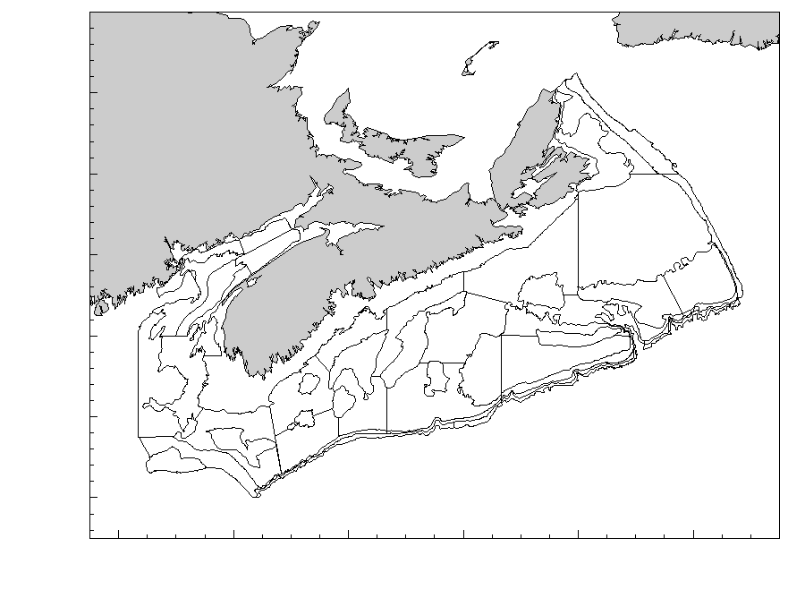
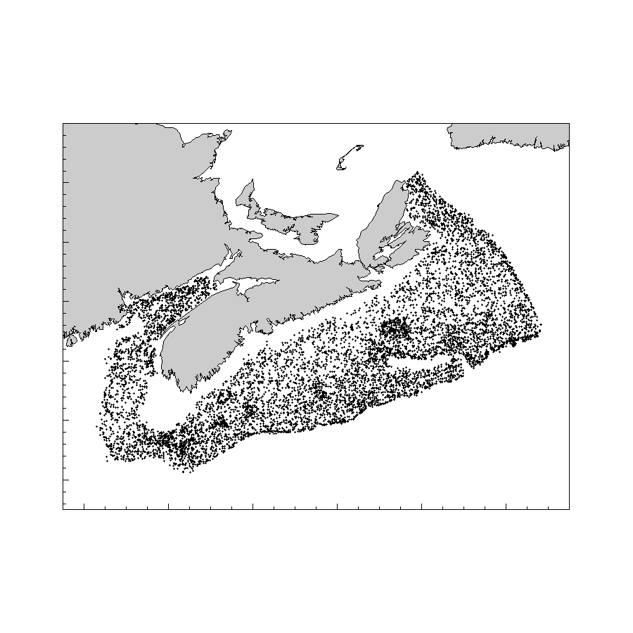

# Methods
## Survey Description
The survey is conducted annually in July-August and covers the Scotian Shelf and the Bay of Fundy (Figure \@ref(fig:map1)). It normally involves two separate two-week trips on board an offshore fisheries vessel from the Canadian Coast Guard.

A number of changes in fishing gear type and vessels used occurred since the onset of sampling activities [@ClarkEmberley2011].

(ref:caption-map1) Map of the Scotian Shelf and Bay of Fundy. 

```{r map1, fig.cap="(ref:caption-map1)"}
knitr::include_graphics("../Mapping/annotated-map-NAFO.png")
```


## Sampling Design
The summer survey covers divisions 4V, 4W and 4X of the Northwest Atlantic Fisheries Organization (NAFO) which includes the Scotian Shelf and the Bay of Fundy. The eastern limit of the survey is the Laurentian Channel and the western limit is the Fundian Channel (Figure \@ref(fig:map1)).

The survey follows a stratified random design [@DoubledayRivard1981; @Lohr1999] (Figure \@ref(fig:map2)). The number of tows conducted in each stratum is approximately proportional to its surface area.

(ref:caption-map2) Map of the Summer survey strata. 

```{r map2, fig.cap="(ref:caption-map2)"}

```


The basic sampling unit of the survey is a 30-minute fishing tow conducted at a speed of 3.5 knots. This yields a distance towed of 1.75 nautical miles.

After each tow the catch is sorted by species and weighed. Each fish caught is then measured, and further sampling of individual fish weight, maturity status and age are performed for different length classes. When catches exceed 300 individuals, a random sub-sample is used to obtain the length and weight measurements.

The location of representative tows appears in Figure \@ref(fig:map3).

(ref:caption-map3) Map of the Summer survey tows. 

```{r map3, fig.cap="(ref:caption-map3)"}

```


## Taxonomic Levels {#taxo}

Fish species caught during the surveys are identified by trained scientific personnel and their scientific name is determined. An internal species code used in the relational database is reported for each species [@LosierWaite1989].

By its nature as a bottom trawl, the fishing gear used in the survey catches certain species better than others. To ensure that meaningful ecological information can be extracted from catch samples, we report the catch records for the subset of species that are caught reliably by the gear. To appear in this atlas, a species must have had a minimum of 10 observations over the duration of the survey activities. While both catch abundance and weight are recorded, the weight of species that appear at low abundances is often recorded as zero in the earlier parts of the survey when scales of appropriate precision were not available.

We divided the species caught into five categories based on 1) their taxonomic classification, 2) the number of recorded observations, and 3) their period of valid identification (Table \@ref(tab:taxocat)). Category ”L”, for ”long”, was assigned to species that have more than 1000 records since 1970 and have been consistently identified since the onset of the survey. Category ”S”, for ”short”, was assigned to invertebrate species that were consistently sampled only since 1999 [@Tremblayetal:2007]. Category ”I”, for ”intermediate”, was assigned to species that had between 1000 and 200 catch records. Rare and elusive species (those with less than 200 catch records over the duration of the survey) are also reported but to a lower level of analytical details (Category ”LR”, for ”long rare”, and category ”SR”, for ”short rare”).

\begin{table}
\begin{tabular}{p{0.1\textwidth}|p{0.2\textwidth}|p{0.7\textwidth}}
\toprule
\bfseries{Category} & \bfseries{Name} & \bfseries{Description} \\
\midrule
L & long & species that have more than 1000 records since 1970 and have been consistently identified since the onset of the survey \\
\midrule
S & short & invertebrate species that were consistently sampled only since 1999 \\
\midrule
I & intermediate & species that had between 1000 and 200 catch records \\
\midrule
LR & long rare & species with less than 200 catch records over the duration of the survey and that have been consistently identified since the onset of the survey\\
\midrule
SR & short rare & species with less than 200 catch records and that were consistently sampled only since 1999\\
\bottomrule
\end{tabular}
\caption{Taxonomic levels}
\label{tab:taxocat}
\end{table}

The list of taxa covered in this document is presented in phylogenetic order [@Nelsonetal:2004] in Table \@ref(tab:tabspecies). To ensure concordance with authoritative taxonomic information, the AphiaID from the World Register of Marine Species is also provided in Table \@ref(tab:tabspecies) [@WoRMS].

(ref:spec-fig-cap) List of species included in the Atlas. The species reported here are listed in phylogenetic order as per @page:etal:7thedition. For each taxonomic order and class, each species is listed in the table, its taxonomic family and scientific name is provided, along with its French and English common names, the species code used in the survey database, its AphiaID and a link to the World Registry of Marine Species, its number of catch records in the survey database and its classification category as defined in section \@ref(taxo).

```{r tabspecies}
library(tidyverse)
spec.tab <- read.csv("../species-list-for-report-APHIA.csv", encoding = "UTF-8")
urls <- spec.tab$url
sections <- paste0("#sec:",spec.tab$spec)

vars <- c("class","order","family","scientificname","FAO_E_COMMON_NAME","FAO_F_COMMON_NAME","spec", "AphiaID", "nrecords","type")

knitr::kable(spec.tab[,vars], "latex", booktabs = TRUE, longtable = TRUE, align = "c", col.names = c("Class","Order","Family","Scientific name","English name","French name","Species code","AphiaID","Num. records","Ticket class"), caption = "(ref:spec-fig-cap)") %>%
  kableExtra::landscape() %>%
  kableExtra::collapse_rows(1:3, row_group_label_position = 'stack') %>% 
  kableExtra::column_spec(4, italic=T, width="3cm") %>% 
  kableExtra::column_spec(5, width="3cm") %>% 
  kableExtra::column_spec(6, width="3cm") %>% 
  kableExtra::column_spec(7, width="3cm") %>% 
  kableExtra::column_spec(7, link=sections) %>% 
  kableExtra::column_spec(8, link=urls) %>% 
  kableExtra::kable_styling(font_size = 9, latex_options = "repeat_header", repeat_header_text = "", repeat_header_method = "replace") %>%  
  sub("\\caption\\[\\]\\{\\}", "\\caption*{}", .) 

```


## Analyses

The Oracle relational database where all data are stored was accessible from the Bedford Institute of Oceanography in Dartmouth, Nova Scotia. Structured Query Language (SQL) is used to extract the data from the production server and to create the data products used in all subsequent analyses. Catch records classified as ”valid” (i.e. a representative tow without damage to the net) are used in the current analyses. To make the available samples comparable, catch number and weight for each species was standardized for the distance towed.

All data processing and analyses were conducted using the R software [@R:2020] using packages gstat [@R:package:gstat], PBSmapping [@R:package:PBSmapping], RODBC [@R:package:RODBC], spatstat [@R:package:spatstat],  maptools [@R:package:maptools], rgeos [@R:package:rgeos], classInt[@R:package:classInt], RColorBrewer[@R:package:RColorBrewer], MASS [@R:package:MASS], worms [@R:package:worms], and tidyverse [@R:Tidyverse]. 

### Geographic distribution of catches

Spatial interpolation of catch biomass (kg/tow) or abundance (number/tow) was done using a weighting inversely proportional to the distance, using function ”idw” of the spatstat R package [@R:package:spatstat].

### Abundance and biomass indices

For each species, stratified random estimates of catch abundance and biomass [@Smith:1996] are computed for each year. Yearly estimates of the standard error were also computed.

### Distribution indices

For each Category L, I and S fish species, the minimum area required to account for 75% and 95% of the total biomass or abundance were computed (D75% and D95%). These measures of distributions were computed for each year by using the Lorenz curve of mean stratum-level catch estimates and the area of occupied strata [@Swain:Sinclair:1994:cjfas; @Swain:Morin:1996:cjfas].

### Length frequencies

The length frequency distribution of catch is tabulated for each seven-year period (1970-2009), and last ten-year period (2010-2020).

### Length-weight relationship and condition factor

The relationship between the weight and the length of fish was estimated using the following non-linear isometric relationship:

\begin{eqnarray*}\label{eqLengthWeight}
W = \alpha L ^\beta  
\\
\end{eqnarray*}

where W is the total weight (g), L is the length (cm), and, $\alpha$ and $\beta$ are the parameters to be estimated. 

Average fish condition (C) is computed as:

\begin{eqnarray*}\label{eqCondition}
C = \frac{W}{\alpha L ^\beta}  
\\
\end{eqnarray*}

### Depth, temperature and salinity distribution of catches

For each category L species, We followed the methods developed by [@Perry:Smith:1994:cjfas] and generated cumulative frequency distributions of depth, temperature and salinity of survey catches.

### Density-dependent habitat selection

We follow the methods of [@Myers:Stokes:1989] to evaluate how fish abundance in each stratum varied with overall temporal fluctuations of population abundance.

For each category L species, we fitted a model of the relationship between stratum-level density and overall abundance (the yearly stratified random estimate of abundance, defined above). To properly use the observations of zero catch while accounting for the logarithmic distribution of catch abundance, we implemented the model as a generalised linear using a log link and a Poisson error distribution:

\begin{eqnarray*}\label{eqHabitat Selection}
Y_{h,i} = \alpha_{h} Y_{i}^{\beta_h}
\\
\end{eqnarray*}

where, $y_{h,i}$ is the average abundance of stratum $h$ in year $i$, and $\alpha_{h,i}$ and  $\beta_{h,i}$ are the fitted parameters. The estimated parameter $\beta_{h,i}$ is referred to as the "slope parameter" and indicates whether stratum-level density is positively ($\beta_{h,i} <= 0$), negatively ($\beta_{h,i} >= 0$) or negligibly ($\beta_{h,i} \approx 0$) related to population abundance.

To estimate the suitability of each stratum, the median abundance observed during the years that are in the top 25% of yearly estimates is used. We combine the slope parameter estimates from the above model with the median abundance to identify strata that have consistently high abundance and whose local density is weakly related to fluctuation in population abundance ($\beta_{h,i} \approx 0$). Preferred strata are identified for each category L species.
