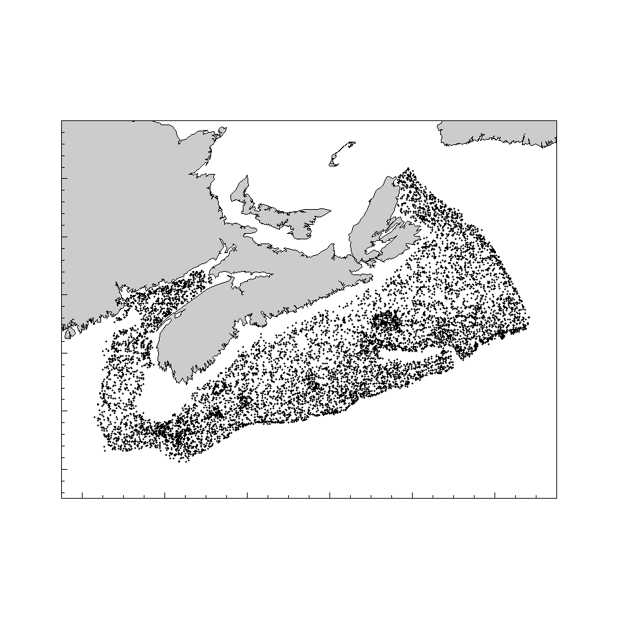

# Results

The depth, bottom temperature and bottom salinity cumulative frequency distribution for the survey are presented in Figure \@ref(fig:setsdist).

(ref:setsdistcap) Cumulative frequencey distribution of depth, bottom temperature and bottom salinity of representative sets from the summer survey. 

```{r setsdist, fig.cap="(ref:setsdistcap)"}

```

The plots generated for each species are presented in the Appendix.

## Description of Figures

### Type A
For Category L and S species: 

Spatial distribution of catch-per unit of effort, (CPUE, kilograms per tow) in July-August for the Bay of Fundy and Scotian Shelf in five-year periods. Spatial interpolation between tows was done using Inverse Distance Weight (IDW). The probability of occurrence (proportion of tows with catch records for a given species) was also reported for each five-year period.

For Category LR and SR:

Location of tows with catch over the period 1970-2020 (Type LR) or the period 1999-2020 (Type SR). Location of tows with catch over the period 1970-2020 (Type LR) or the period 1999-2020 (Type SR).

### Type B
For Category L, S and I species:

Stratified random estimate of CPUE (left panel), distribution indices (D75% and D95%, the minimum area containing 75% and 95% of biomass, middle panel), and distribution vs. weight per tow (right panel). The stratified random mean is plotted as a solid line with the 95% confidence region indicated by the solid grey line. The overall mean is plotted as a grey horizontal line and the overall mean plus or minus 50% of the standard deviation appear as horizontal dashed lines. In all three panels, the early years appear in blue and the last years appear in red. The predictions from a loess estimator are overlaid on the distribution indices (middle panel). The Pearson correlation coefficient between D75% and biomass, and its statistical significance, are also reported in the right panel.

### Type C.
Length frequency distribution for NAFO divisions 4X and 4VW. A smoothed length frequency distribution is shown for each 7-year periods covered by the surveys.

### Type D.
Average fish condition for all fish lengths (black dots and black line), large fish (thick gray line), and small fish (thin gray line). Fish condition is presented for NAFO divisions 4VW (right panel) and 4X (left panel).

### Type E.
Cumulative frequency distributions of depth, temperature and salinity at all sampled locations (thick solid line) and at fishing locations with catch records (thin dashed line). The depth, temperature and salinity associated with 5%, 25%, 50%, 75% and 95% of the cumulative catch is shown in tabular fashion on the bottom right panel.

### Type F.
Slopes estimates from the density-dependent habitat selection model (y axis) plotted versus the median abundance during the top 25% of years. The red box indicates strata of particular importance for a species by identifying slopes that are within a standard error from zero and that are within the top 25% of median abundance. Each stratum is identified on the plot by the last two digits of its number.

## Summary of successful tows by year and stratum
<!-- There is something weird going on here, there are 2 tows with NAs for stratum, (HAM1980042 set 62 and HAM1982072 set 13). -->
```{r}
tows.strata.year <- read.csv("Atlas-summary-table-tows-by-year-stratum.csv")
```

A total of `r tows.strata.year[nrow(tows.strata.year),ncol(tows.strata.year)]` representative tows were conducted for the period spanning from `r substring(names(tows.strata.year)[4],3,7)` to `r substring(names(tows.strata.year)[ncol(tows.strata.year)-1],3,7)` (Figure \@ref(fig:map3)).

Tables \@ref(tab:tabtowstratumyear1), \@ref(tab:tabtowstratumyear2) and \@ref(tab:tabtowstratumyear3) present the number of tows conducted in each stratum and year.


(ref:caption-map3) Map of the Summer survey tows. 

```{r map3, fig.cap="(ref:caption-map3)"}

```


\begin{landscapepage}


```{r tabtowstratumyear1, results="asis"}
#  Number of tows by stratum-year

tows.strata.year <- read.csv("Atlas-summary-table-tows-by-year-stratum.csv")

yrs <- 1970:1989
ii <- which(substring(names(tows.strata.year),3,6) %in% as.character(yrs))
tows.strata.year.1 <- tows.strata.year[,c(1,2,3,ii)]
nr <- nrow(tows.strata.year.1)
## blank the first two columns of the last row
tows.strata.year.1[49,1:2] <- ""

csas_table(tows.strata.year.1,
  col.names=c("Stratum","NAFO Div.","Area (km2)",as.character(yrs)),
  caption = paste0("Number of representative tows conducted in each stratum during the period ",yrs[1]," to ",yrs[length(yrs)],"."),
  format = "latex", align=c("c",rep("r",15))
  ) %>%
  #kableExtra::landscape() %>%
#  kableExtra::kable_styling(font_size = 7, latex_options = "repeat_header", repeat_header_method = "replace") %>% 
  kableExtra::kable_styling(font_size = 6) %>% 
  sub("\\caption\\[\\]\\{\\}", "\\caption*{}", .) 
```

```{r tabtowstratumyear2, results="asis"}
yrs <- 1990:2009
ii <- which(substring(names(tows.strata.year),3,6) %in% as.character(yrs))
tows.strata.year.2 <- tows.strata.year[,c(1,2,3,ii)]
nr <- nrow(tows.strata.year.2)
## blank the first two columns of the last row
tows.strata.year.2[49,1:2] <- ""

csas_table(tows.strata.year.2,
  col.names=c("Stratum","NAFO Div.","Area (km2)",as.character(yrs)),
  caption = paste0("Number of representative tows conducted in each stratum during the period ",yrs[1]," to ",yrs[length(yrs)],"."),
  format = "latex", align=c("c",rep("r",15))
  ) %>%
  #kableExtra::landscape() %>%
#  kableExtra::kable_styling(font_size = 7, latex_options = "repeat_header", repeat_header_method = "replace") %>% 
  kableExtra::kable_styling(font_size = 6) %>% 
  sub("\\caption\\[\\]\\{\\}", "\\caption*{}", .) 
```

```{r tabtowstratumyear3, results="asis"}
yrs <- 2010:2020
ii <- which(substring(names(tows.strata.year),3,6) %in% as.character(yrs))
tows.strata.year.3 <- tows.strata.year[,c(1,2,3,ii)]
nr <- nrow(tows.strata.year.3)
## blank the first two columns of the last row
tows.strata.year.3[49,1:2] <- ""

## totals in the last column
tows.strata.year.3[,ncol(tows.strata.year.3)+1] <- tows.strata.year[,ncol(tows.strata.year)]

csas_table(tows.strata.year.3,
  col.names=c("Stratum","NAFO Div.","Area (km2)",as.character(yrs),"Total"),
  caption = paste0("Number of representative tows conducted in each stratum during the period ",yrs[1]," to ",yrs[length(yrs)], " and for the whole 1970 to 2020 period."),
  format = "latex", align=c("c",rep("r",15))
  ) %>%
  #kableExtra::landscape() %>%
#  kableExtra::kable_styling(font_size = 7, latex_options = "repeat_header", repeat_header_method = "replace") %>% 
  kableExtra::kable_styling(font_size = 6) %>% 
  sub("\\caption\\[\\]\\{\\}", "\\caption*{}", .) 

```
\end{landscapepage}

