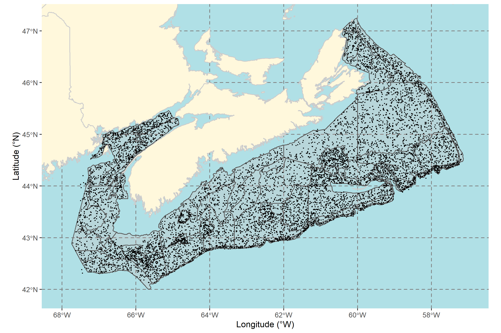
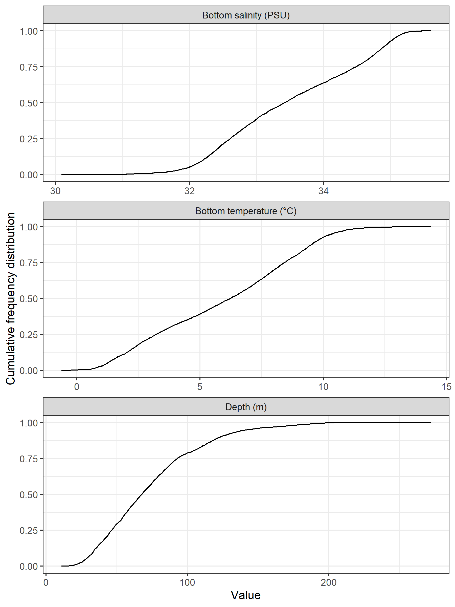

# Results

The plots generated for each species are presented in the Appendix.

## Summary of successful tows by year and stratum
<!-- There is something weird going on here, there are 2 tows with NAs for stratum, (HAM1980042 set 62 and HAM1982072 set 13). -->
```{r}
tows.strata.year <- read.csv("Atlas-summary-table-tows-by-year-stratum.csv")
```

A total of `r tows.strata.year[nrow(tows.strata.year),ncol(tows.strata.year)]` representative tows were conducted for the period spanning from `r substring(names(tows.strata.year)[4],3,7)` to `r substring(names(tows.strata.year)[ncol(tows.strata.year)-1],3,7)` (Figure \@ref(fig:map3)). Tables \@ref(tab:tabtowstratumyear1), \@ref(tab:tabtowstratumyear2) and \@ref(tab:tabtowstratumyear3) present the number of tows conducted in each stratum and year.

(ref:caption-map3) Map of the `r tows.strata.year[nrow(tows.strata.year),ncol(tows.strata.year)]` representative tows in the Summer survey from `r substring(names(tows.strata.year)[4],3,7)` to `r substring(names(tows.strata.year)[ncol(tows.strata.year)-1],3,7)`. 

\begin{landscapepage}

```{r map3, fig.cap="(ref:caption-map3)", out.width="100%", out.height="100%"}

```

\newpage


```{r tabtowstratumyear1, results="asis"}
#  Number of tows by stratum-year

tows.strata.year <- read.csv("Atlas-summary-table-tows-by-year-stratum.csv")

yrs <- 1970:1989
ii <- which(substring(names(tows.strata.year),3,6) %in% as.character(yrs))
tows.strata.year.1 <- tows.strata.year[,c(1,2,3,ii)]
nr <- nrow(tows.strata.year.1)
## blank the first two columns of the last row
## write "Total" as a multi-column for the first two colunns of the last row
tows.strata.year.1[nr,1:2] <- ""
tows.strata.year.1[nr,2] <- "Total"

csas_table(tows.strata.year.1,
  col.names=c("Stratum","NAFO Div.","Area (km2)",as.character(yrs)),
  caption = paste0("Number of representative tows conducted in each stratum during the period ",yrs[1]," to ",yrs[length(yrs)],"."),
  format = "latex", align=c("c",rep("r",15))
  ) %>%
  #kableExtra::landscape() %>%
#  kableExtra::kable_styling(font_size = 7, latex_options = "repeat_header", repeat_header_method = "replace") %>% 
  kableExtra::kable_styling(font_size = 6) %>% 
  kableExtra::row_spec(nr, bold=TRUE) %>% 
  sub("\\caption\\[\\]\\{\\}", "\\caption*{}", .) 
```

```{r tabtowstratumyear2, results="asis"}
yrs <- 1990:2009
ii <- which(substring(names(tows.strata.year),3,6) %in% as.character(yrs))
tows.strata.year.2 <- tows.strata.year[,c(1,2,3,ii)]
nr <- nrow(tows.strata.year.2)
## blank the first two columns of the last row
tows.strata.year.2[nr,1:2] <- ""
tows.strata.year.2[nr,2] <- "Total"

csas_table(tows.strata.year.2,
  col.names=c("Stratum","NAFO Div.","Area (km2)",as.character(yrs)),
  caption = paste0("Number of representative tows conducted in each stratum during the period ",yrs[1]," to ",yrs[length(yrs)],"."),
  format = "latex", align=c("c",rep("r",15))
  ) %>%
  #kableExtra::landscape() %>%
#  kableExtra::kable_styling(font_size = 7, latex_options = "repeat_header", repeat_header_method = "replace") %>% 
  kableExtra::kable_styling(font_size = 6) %>% 
  kableExtra::row_spec(nr, bold=TRUE) %>% 
  sub("\\caption\\[\\]\\{\\}", "\\caption*{}", .) 
```

```{r tabtowstratumyear3, results="asis"}
yrs <- 2010:2020
ii <- which(substring(names(tows.strata.year),3,6) %in% as.character(yrs))
tows.strata.year.3 <- tows.strata.year[,c(1,2,3,ii)]
nr <- nrow(tows.strata.year.3)
## blank the first two columns of the last row
tows.strata.year.3[nr,1:2] <- ""
tows.strata.year.3[nr,2] <- "Total"

## totals in the last column
tows.strata.year.3[,ncol(tows.strata.year.3)+1] <- tows.strata.year[,ncol(tows.strata.year)]

csas_table(tows.strata.year.3,
  col.names=c("Stratum","NAFO Div.","Area (km2)",as.character(yrs),"Total"),
  caption = paste0("Number of representative tows conducted in each stratum during the period ",yrs[1]," to ",yrs[length(yrs)], " and for the whole 1970 to 2020 period."),
  format = "latex", align=c("c",rep("r",15))
  ) %>%
  #kableExtra::landscape() %>%
#  kableExtra::kable_styling(font_size = 7, latex_options = "repeat_header", repeat_header_method = "replace") %>% 
  kableExtra::kable_styling(font_size = 6) %>% 
  kableExtra::row_spec(nr, bold=TRUE) %>% 
  sub("\\caption\\[\\]\\{\\}", "\\caption*{}", .) 

```
\end{landscapepage}

\clearpage

## Distribution of depth, bottom temperature and bottom salinity from survey tows

The depth, bottom temperature and bottom salinity cumulative frequency distribution for the survey are presented in Figure \@ref(fig:setsdist).

(ref:setsdistcap) Cumulative frequency distribution of bottom salinity (top panel), bottom temperature (middle panel) and depth (bottom panel) of representative sets from the DFO Maritimes summer survey. 

```{r setsdist, fig.cap="(ref:setsdistcap)"}

```


### Decadal distribution of surface and bottom temperatures

The decadal cumulative frequency distribution of surface and bottom temperatures of representative sets from the DFO Maritimes summer survey showcase warmer values of both surface and bottom temperature in the last decade (Figure \@ref(fig:setsdistdecadal)). 


(ref:setsdistcapdecadal) Decadal cumulative frequency distribution of surface temperature (top panel) and bottom temperature (bottom panel) of representative sets from the DFO Maritimes summer survey. Note warmer values of both surface and bottom temperature in the last decade. 

```{r setsdistdecadal, fig.cap="(ref:setsdistcapdecadal)"}

```

